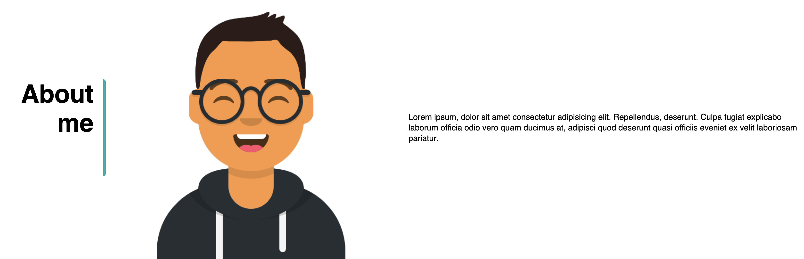

# My-Portfolio

## Purpose

This is will be the first draft of my portfolio/catalogue of development work. This webpage consists of a brief description of myself and my journey (currently still a placeholder), the various work/projects that I have worked on, and how to reach out to me. The end goal of this webpage is to act as a resume for potential employers to view my work.

## Screenshots
Header

About Me

Portfolio

Contact

## Built With
* HTML
* CSS

## Website
https://tonymengt.github.io/My-Portfolio/

